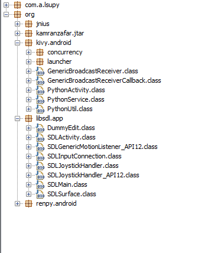
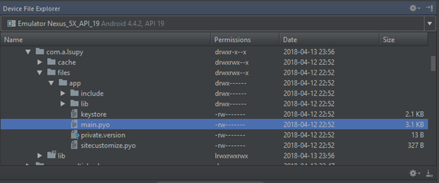
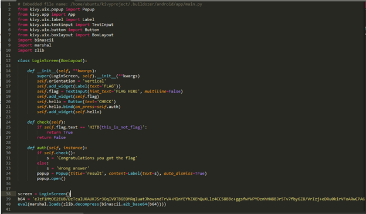

- When looking at the libs used, we can guess that it is related to Python.

- Looking at the log, I close the app and then played a little bit with the file system:…

- We retrieve the following code during decompilation of this file:

Reverse this we have flag: `HITB{1!F3_1S_&amp;H%r7_v$3_pY7#ON!}`