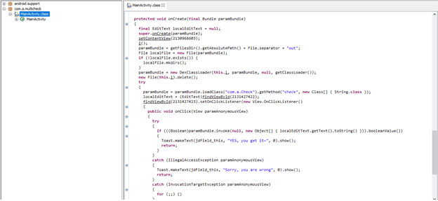

- The first step that I took is to decompile the given app. I decompile .dex files with dex2jar:

- First i found the fake flag: `HITB{this_ is_certainly_not_the_flag} ` OH NOOOOOOOOOO~~~

- More time later i found the file caculate the flag.
[check.class](check.class)

There are a lot of checking methods with simple calculations, and to obtain the flag we can simply reverse them to get the flag:
`HITB{SEe!N9_IsN'T_bELIEV1Ng}`
