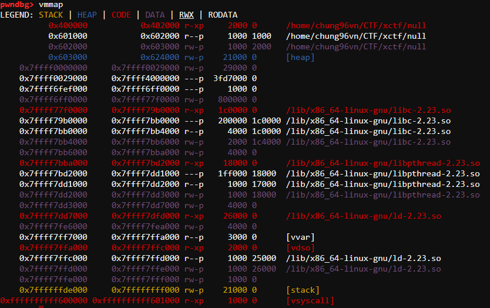
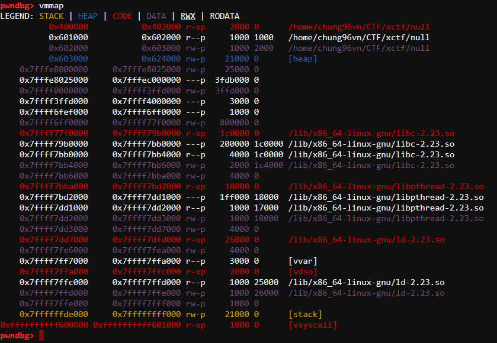
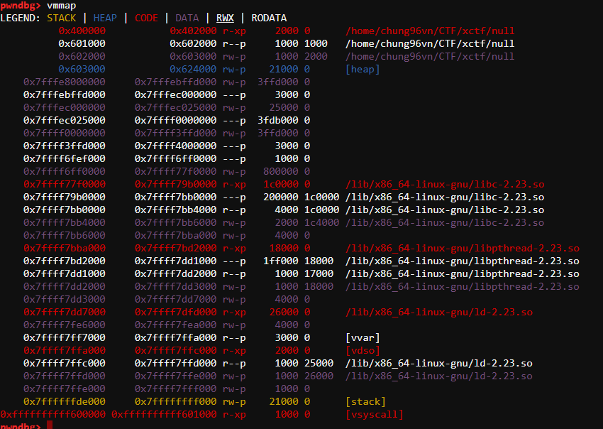

## Mở đầu
Hôm nay mình sẽ trình bày lại một kỹ thuật hay trong exploit heap data in thread handle.

Bài viết bắt nguồn ý tưởng từ một write up khác: [link](https://gist.github.com/romanking98/630f2b3c7216ae389f4ea3ce551041e1)

Bài viết này mình sẽ phân tích rõ hơn cũng như cụ thể hơn write up được dẫn ở link trên.

## Problem
Binary : [Download](null)

Libc: [Download](libc.so.6)

## Start analysis

Dưới đây là mã nguồn của thread
```c
__int64 __fastcall start_routine(void *a1)
{
  int i; // [rsp+14h] [rbp-1Ch]
  int choose; // [rsp+18h] [rbp-18h]
  int size; // [rsp+1Ch] [rbp-14h]
  int block; // [rsp+20h] [rbp-10h]
  char *pointer; // [rsp+28h] [rbp-8h]

  write(1, "***************************************\n", 0x28uLL);
  write(1, "* Welcome to Nu1L's /dev/null service *\n", 0x28uLL);
  write(1, "***************************************\n", 0x28uLL);
  write(1, "1. use /dev/null service\n", 0x19uLL);
  write(1, "2. exit\n", 8uLL);
  func_602038 = (__int64 (__fastcall *)(_QWORD, _QWORD))sub_400AF8;
  while ( 1 )
  {
    while ( 1 )
    {
      write(1, "Action: ", 8uLL);
      choose = read_int();
      if ( choose != 1 )
        break;
      write(1, "Size: ", 6uLL);
      size = read_int();
      if ( size >= 0 && size <= 0x4000 )
      {
        write(1, "Pad blocks: ", 0xCuLL);
        block = read_int();
        if ( block >= 0 && block <= 1000 )
        {
          for ( i = 0; i < block; ++i )
            malloc(size);
          pointer = (char *)malloc(size);
          write(1, "Content? (0/1): ", 0x10uLL);
          if ( read_int() )
          {
            write(1, "Input: ", 7uLL);
            read_input(pointer, size);
            func_602038(pointer, size);
          }
        }
        else
        {
          write(1, "Invalid padblock count.\n", 0x18uLL);
        }
      }
      else
      {
        write(1, "Invalid size.\n", 0xEuLL);
      }
    }
    if ( choose == 2 )
      break;
    if ( choose == 1337 )
      system("/usr/bin/id");
    else
      write(1, "Invalid command.\n", 0x11uLL);
  }
  return sub_400AD6(0);
}
```

Hàm `read_input` là hàm có lỗi overflow.
```c
size_t __fastcall read_input(char *buf, size_t size)
{
  size_t result; // rax
  int v3; // [rsp+1Ch] [rbp-14h]
  size_t i; // [rsp+20h] [rbp-10h]

  for ( i = 0LL; ; i += v3 )
  {
    result = i;
    if ( i >= size )
      break;
    v3 = read(0, &buf[i], size);
    if ( v3 <= 0 )
    {
      write(1, "I/O error\n", 0xAuLL);
      sub_400AD6(1u);
    }
  }
  return result;
}
```

Về cơ bản lỗi của chương trình là lỗi heap overflow. Thoạt nhìn thì minh không thấy có free trong chương trình nghĩ ngay đến `House of Orange`.
Tuy nhiên mình không có cách nào để có thể lấy ra được địa chỉ của heap. Nên việc sử dụng `House of Orange` có vẻ không ổn.

Vậy câu hỏi đặt ra cho mình lúc này là?? Kỹ thuật sử dụng ở đây là gì?? Mĩnh cũng đọc malloc.c cũng tìm kiếm các đoạn code có liên quan nhưng có vẻ mọi thứ không được như ý muốn.
Rồi mình nhận được write up của một team khác. Đọc qua thì thấy focus vào `_int_malloc`. Ohhhhhhhhhhhhhhhhhhhhh đây rồi.

Mình đọc qua hướng của tác giả nhưng cũng không được hiểu cho lắm vì tác giả viết không được rõ ràng. Chính vì thế mình quyết định debug libc để có thể hiểu rõ hơn.

Sau đây mình sẽ trình bày quá trình phân tích libc của mình. Để tiện cho việc phân tích thì mình đã turn off ASLR: `echo 0 | sudo tee /proc/sys/kernel/randomize_va_space`

Focus vào `_int_malloc` [source](https://github.com/str8outtaheaps/heapwn/blob/master/malloc/sysmalloc.c#L142)
```c
static void* sysmalloc(INTERNAL_SIZE_T nb, mstate av)
{
    ...
    if (av != &main_arena)
    {
      heap_info *old_heap, *heap;
    ...
    }
    ...
}
```
Khi gọi đến sysmalloc thì hệ thống sẽ kiểm tra arena nếu arena khác main arena thì sẽ chạy đến đoạn code sau:
```c
    ...
    if ((long) (MINSIZE + nb - old_size) > 0
	&& grow_heap(old_heap, MINSIZE + nb - old_size) == 0) {
      av->system_mem += old_heap->size - old_heap_size;
      arena_mem += old_heap->size - old_heap_size;
      set_head(old_top, (((char *)old_heap + old_heap->size) - (char *)old_top)
	       | PREV_INUSE);
    }
    else if ((heap = new_heap(nb + (MINSIZE + sizeof(*heap)), mp_.top_pad))) {
      /* Use a newly allocated heap.  */
      heap->ar_ptr = av;
      heap->prev = old_heap;
      av->system_mem += heap->size;
      arena_mem += heap->size;
      /* Set up the new top.  */
      top(av) = chunk_at_offset(heap, sizeof(*heap));
      set_head(top(av), (heap->size - sizeof(*heap)) | PREV_INUSE);

      /* Setup fencepost and free the old top chunk with a multiple of
	 MALLOC_ALIGNMENT in size. */
      /* The fencepost takes at least MINSIZE bytes, because it might
	 become the top chunk again later.  Note that a footer is set
	 up, too, although the chunk is marked in use. */
      old_size = (old_size - MINSIZE) & ~MALLOC_ALIGN_MASK;
      set_head(chunk_at_offset(old_top, old_size + 2*SIZE_SZ), 0|PREV_INUSE);
      if (old_size >= MINSIZE) {
	set_head(chunk_at_offset(old_top, old_size), (2*SIZE_SZ)|PREV_INUSE);
	set_foot(chunk_at_offset(old_top, old_size), (2*SIZE_SZ));
	set_head(old_top, old_size|PREV_INUSE|NON_MAIN_ARENA);
	_int_free(av, old_top, 1);
      } else {
	set_head(old_top, (old_size + 2*SIZE_SZ)|PREV_INUSE);
	set_foot(old_top, (old_size + 2*SIZE_SZ));
      }
    }
    ...
```
Đây là `maps` của trương trình:


Size được cấp phát của `thread heap` ban đầu là `0x25000`, sau khi cấp phát số lượng vượt quá size này thì hệ thống sẽ kiểm tra `grow_heap` để cấp phát thêm vùng nhớ cho `thread heap`.

```c
static int
grow_heap(heap_info *h, long diff)
{
  size_t page_mask = GLRO(dl_pagesize) - 1;
  long new_size;

  diff = (diff + page_mask) & ~page_mask;
  new_size = (long)h->size + diff;
  if((unsigned long) new_size > (unsigned long) HEAP_MAX_SIZE)
    return -1;
  if((unsigned long) new_size > h->mprotect_size) {
    if (__mprotect((char *)h + h->mprotect_size,
		   (unsigned long) new_size - h->mprotect_size,
		   PROT_READ|PROT_WRITE) != 0)
      return -2;
    h->mprotect_size = new_size;
  }

  h->size = new_size;
  return 0;
}
```
Sau khi cấp phát vượt quá thì chương trình sẽ thực hiện lệnh `__mprotect` để cấp phát thêm vùng nhớ cho `thread heap`



Trong vấn đề ở binary này thì chương trình cho t malloc kích thước tối đa là 0x4000 nhưng lại cho thực hiện malloc nhiều lần.
==> Trigger để bypass `(unsigned long) new_size > (unsigned long) HEAP_MAX_SIZE` ==> `grow_heap` return `-1` ==> call `new_heap` để cấp phát thêm một vùng `heap_info` nữa để sử dụng trong cấp phát bộ nhớ động cho thread khi vùng nhớ ban đầu đã được sử dụng hết.

```
 ► 0x7ffff78712f6 <sysmalloc+166>    cmp    rbx, rax <0x7ffff7bb4b20>
   0x7ffff78712f9 <sysmalloc+169>    je     sysmalloc+912 <0x7ffff78715e0>
 
   0x7ffff78712ff <sysmalloc+175>    mov    rax, rbp
   0x7ffff7871302 <sysmalloc+178>    mov    r14, r13
   0x7ffff7871305 <sysmalloc+181>    sub    rax, r12
   0x7ffff7871308 <sysmalloc+184>    and    r14, 0xfffffffffc000000
   0x7ffff787130f <sysmalloc+191>    add    rax, 0x20
   0x7ffff7871313 <sysmalloc+195>    test   rax, rax
   0x7ffff7871316 <sysmalloc+198>    jle    sysmalloc+536 <0x7ffff7871468>
 
   0x7ffff787131c <sysmalloc+204>    lea    rcx, [r15 + rax - 1]
```
```
*RAX  0x7ffff7bb4b20 (main_arena) ◂— 0x100000000
*RBX  0x7ffff0000020 ◂— 0x300000001
```
> Kiểm tra so sánh arena: `if (av != &main_arena)`

```
   0x7ffff7871316 <sysmalloc+198>    jle    sysmalloc+536 <0x7ffff7871468>
 
   0x7ffff787131c <sysmalloc+204>    lea    rcx, [r15 + rax - 1]
   0x7ffff7871321 <sysmalloc+209>    and    rcx, qword ptr [rsp + 0x18]
   0x7ffff7871326 <sysmalloc+214>    mov    r9, qword ptr [r14 + 0x10]
   0x7ffff787132a <sysmalloc+218>    add    rcx, r9
 ► 0x7ffff787132d <sysmalloc+221>    cmp    rcx, 0x4000000
   0x7ffff7871334 <sysmalloc+228>    ja     sysmalloc+536 <0x7ffff7871468>
    ↓
   0x7ffff7871468 <sysmalloc+536>    mov    rsi, qword ptr [rip + 0x342cf9] <0x7ffff7bb4168>
   0x7ffff787146f <sysmalloc+543>    lea    rdi, [rbp + 0x40]
   0x7ffff7871473 <sysmalloc+547>    call   new_heap <0x7ffff786d300>
 
   0x7ffff7871478 <sysmalloc+552>    test   rax, rax
```
```
*RCX  0x4001000
```
> Bypass `(unsigned long) new_size > (unsigned long) HEAP_MAX_SIZE`

==> Trigger call `new_heap`:
```
 ► 0x7ffff7871473 <sysmalloc+547>    call   new_heap <0x7ffff786d300>
        rdi: 0x4040
        rsi: 0x20000
```
```c
static heap_info *
internal_function
new_heap(size_t size, size_t top_pad)
{
  size_t page_mask = GLRO(dl_pagesize) - 1;
  char *p1, *p2;
  unsigned long ul;
  heap_info *h;

  if(size+top_pad < HEAP_MIN_SIZE)
    size = HEAP_MIN_SIZE;
  else if(size+top_pad <= HEAP_MAX_SIZE)
    size += top_pad;
  else if(size > HEAP_MAX_SIZE)
    return 0;
  else
    size = HEAP_MAX_SIZE;
  size = (size + page_mask) & ~page_mask;

  /* A memory region aligned to a multiple of HEAP_MAX_SIZE is needed.
     No swap space needs to be reserved for the following large
     mapping (on Linux, this is the case for all non-writable mappings
     anyway). */
  p2 = MAP_FAILED;
  if(aligned_heap_area) {
    p2 = (char *)MMAP(aligned_heap_area, HEAP_MAX_SIZE, PROT_NONE,
		      MAP_NORESERVE);
    aligned_heap_area = NULL;
    if (p2 != MAP_FAILED && ((unsigned long)p2 & (HEAP_MAX_SIZE-1))) {
      __munmap(p2, HEAP_MAX_SIZE);
      p2 = MAP_FAILED;
    }
  }
  if(p2 == MAP_FAILED) {
    p1 = (char *)MMAP(0, HEAP_MAX_SIZE<<1, PROT_NONE, MAP_NORESERVE);
    if(p1 != MAP_FAILED) {
      p2 = (char *)(((unsigned long)p1 + (HEAP_MAX_SIZE-1))
		    & ~(HEAP_MAX_SIZE-1));
      ul = p2 - p1;
      if (ul)
	__munmap(p1, ul);
      else
	aligned_heap_area = p2 + HEAP_MAX_SIZE;
      __munmap(p2 + HEAP_MAX_SIZE, HEAP_MAX_SIZE - ul);
    } else {
      /* Try to take the chance that an allocation of only HEAP_MAX_SIZE
	 is already aligned. */
      p2 = (char *)MMAP(0, HEAP_MAX_SIZE, PROT_NONE, MAP_NORESERVE);
      if(p2 == MAP_FAILED)
	return 0;
      if((unsigned long)p2 & (HEAP_MAX_SIZE-1)) {
	__munmap(p2, HEAP_MAX_SIZE);
	return 0;
      }
    }
  }
  if(__mprotect(p2, size, PROT_READ|PROT_WRITE) != 0) {
    __munmap(p2, HEAP_MAX_SIZE);
    return 0;
  }
  h = (heap_info *)p2;
  h->size = size;
  h->mprotect_size = size;
  THREAD_STAT(stat_n_heaps++);
  return h;
}
```
Sau khi chạy `new_heap` thì hệ thống đã tạo thêm một phân vùng nhớ `heap_info`


```
    0x7fffe8000000     0x7fffe8025000 rw-p    25000 0     <=== new heap_info 
    0x7fffe8025000     0x7fffec000000 ---p  3fdb000 0     <=== sử dụng để cấp phát thêm nếu kích thước cấp phát vượt quá heap_info->size 
    0x7ffff0000000     0x7ffff3ffd000 rw-p  3ffd000 0     <=== old heap_info (first heap_info)
```

Vì tối đa một phân vùng `heap_info` chỉ được cấp phát `HEAP_MAX_SIZE(0x4000000)` ta cố thể trigger để tạo thêm một phân vùng `heap_info` nữa để lấp đầy vùng nhớ từ `0x7fffe8000000` đến `0x7ffff0000000`


```
    0x7fffe8000000     0x7fffebffd000 rw-p  3ffd000 0     <=== old heap_info
    0x7fffebffd000     0x7fffec000000 ---p     3000 0      
    0x7fffec000000     0x7fffec025000 rw-p    25000 0     <=== new heap_info 
    0x7fffec025000     0x7ffff0000000 ---p  3fdb000 0     <=== sử dụng để cấp phát thêm nếu kích thước cấp phát vượt quá heap_info->size 
    0x7ffff0000000     0x7ffff3ffd000 rw-p  3ffd000 0     <=== first heap_info 
    0x7ffff3ffd000     0x7ffff4000000 ---p     3000 0      
    0x7ffff6fef000     0x7ffff6ff0000 ---p     1000 0      
    0x7ffff6ff0000     0x7ffff77f0000 rw-p   800000 0      
```

Nhận thấy nếu spam malloc cho tới khi new `heap_info` được phân vùng từ `0x7fffec000000` đến `0x7ffff0000000` thì có thể overflow được first `heap_info` ==> overflow được `thread_arena`
```
    0x7fffe8000000     0x7fffebffd000 rw-p  3ffd000 0      
    0x7fffebffd000     0x7fffec000000 ---p     3000 0      
    0x7fffec000000     0x7ffff0000000 rw-p  4000000 0     <=== current heap_info 
    0x7ffff0000000     0x7ffff3ffd000 rw-p  3ffd000 0     <=== first heap_info 
```

Như vậy tôi đã hoàn thành đến 80% rồi. Tiếp theo là ghi đè `thread_arena` vì `thread_arena` được cấp phát tại first `heap_info`
```
pwndbg> arenas
[            main]           0x603000           0x624000 rw-p    21000 0      [heap]
[  0x7ffff0000020]     0x7ffff00008b0     0x7ffff3ffd8b0 rw-p  3ffd000 0      
pwndbg> 
```
Ở đây tôi ghi đè vào vùng fastbins của `thread_arena` với một địa chỉ trong bss thỏa mãn có thể cấp phát với kích thước `0x60`
```
pwndbg> telescope 0x60201d
00:0000│   0x60201d ◂— 0xfff7bb48e0000000
01:0008│   0x602025 (stdin+5) ◂— 0x7f
02:0010│   0x60202d ◂— 0x0
03:0018│   0x602035 ◂— 0x400af8000000
04:0020│   0x60203d ◂— 0x0
... ↓
pwndbg> 
```
```
pwndbg> bins 0x7ffff0000020
fastbins
0x20: 0x60201d ◂— 0x0
0x30: 0x60201d ◂— 0x0
0x40: 0x60201d ◂— 0x0
0x50: 0x60201d ◂— 0x0
0x60: 0x60201d ◂— 0x0
0x70: 0x60201d ◂— 0x0
0x80: 0x60201d ◂— 0x0
unsortedbin
```
Việc còn lại là overflow ghi đè giá trị của `func_602038` thành địa chỉ `system` và trigger `system("/bin/sh")`

Source exploit : [exploit.py](exploit.py)

